# AutoLang - Smart Hebrew/English Keyboard Switcher

A Chrome extension that automatically remembers and switches between Hebrew and English keyboard layouts based on your browsing tabs.

## 🌟 Features

- **Per-Tab Language Memory**: Automatically remembers which language you use in each browser tab
- **Automatic Keyboard Switching**: Switches your OS keyboard layout when you change tabs
- **Per-Field Mode**: Optional mode to remember language preferences for individual input fields
- **WhatsApp Integration**: Special per-contact language memory for WhatsApp Web
- **Visual Indicators**: Shows floating notifications when language is detected
- **Zero Configuration**: Works out of the box with sensible defaults

## 🚀 How It Works

### Visual Workflow

```mermaid
flowchart TD
    Start([User Types in Browser Tab]) --> Detect[Content Script Detects Language<br/>Hebrew/English Characters]
    Detect --> Store[Background Script Stores<br/>Tab → Language Mapping]
    Store --> Wait[Extension Waits...]

    Wait --> Switch([User Switches to Different Tab])
    Switch --> Lookup[Background Script Looks Up<br/>Language for New Tab]
    Lookup --> Check{Language Different<br/>from Current?}

    Check -->|No| NoAction[No Action Needed]
    Check -->|Yes| Download[Create Trigger File<br/>in Downloads Folder]

    Download --> Poll[AutoHotkey Script<br/>Polling Every 200ms]
    Poll --> Found{Trigger File<br/>Detected?}

    Found -->|Yes| Delete[Delete Trigger File]
    Delete --> Send[Send Alt+Shift<br/>to Windows]
    Send --> OS[Windows Switches<br/>Keyboard Layout]
    OS --> Done([User Can Type in<br/>Correct Language])

    Found -->|No| Poll

    style Start fill:#c8e6c9,stroke:#2e7d32,stroke-width:3px,color:#000
    style Done fill:#c8e6c9,stroke:#2e7d32,stroke-width:3px,color:#000
    style Detect fill:#bbdefb,stroke:#1976d2,stroke-width:2px,color:#000
    style Store fill:#bbdefb,stroke:#1976d2,stroke-width:2px,color:#000
    style Lookup fill:#bbdefb,stroke:#1976d2,stroke-width:2px,color:#000
    style Check fill:#fff9c4,stroke:#f9a825,stroke-width:2px,color:#000
    style NoAction fill:#e0e0e0,stroke:#616161,stroke-width:2px,color:#000
    style Download fill:#ffe0b2,stroke:#e65100,stroke-width:2px,color:#000
    style Poll fill:#1976d2,stroke:#0d47a1,stroke-width:2px,color:#fff
    style Found fill:#f9a825,stroke:#f57f17,stroke-width:2px,color:#000
    style Delete fill:#ff7043,stroke:#d84315,stroke-width:2px,color:#fff
    style Send fill:#7b1fa2,stroke:#4a148c,stroke-width:2px,color:#fff
    style OS fill:#7b1fa2,stroke:#4a148c,stroke-width:2px,color:#fff
```



### Operating Modes

AutoLang operates in two modes:

### 1. Simple Per-Tab Mode (Default)
- Detects which language you're typing in each tab
- Remembers your language preference per tab
- Automatically switches keyboard layout when you switch tabs
- Uses AutoHotkey (Windows) to trigger Alt+Shift for OS-level switching

### 2. Per-Field Mode
- Tracks language preference for each individual input field
- Perfect for forms with mixed-language content
- Stores preferences in browser storage (persists across sessions)

## 📦 Installation

### Prerequisites
- Windows OS (for AutoHotkey integration)
- Chrome or Chromium-based browser
- [AutoHotkey v1.x](https://www.autohotkey.com/) installed

### Steps

1. **Clone this repository**
   ```bash
   git clone https://github.com/ysetbon/AutoLang.git
   cd AutoLang
   ```

2. **Load the Chrome extension**
   - Open Chrome and navigate to chrome://extensions/
   - Enable "Developer mode" (toggle in top-right)
   - Click "Load unpacked"
   - Select the AutoLang folder

3. **Start the AutoHotkey watcher** (REQUIRED!)
   - Double-click `AutoLangWatcher.ahk` to run it
   - The script will run in the background (check system tray for AutoHotkey icon)
   - **⚠️ IMPORTANT**: The extension will NOT switch keyboards without this running!

4. **Add AutoHotkey to Windows Startup** (Highly Recommended!)
   - **Option A - Automatic**:
     - Right-click `install_startup.bat` → "Run as administrator"
     - This ensures AutoLangWatcher runs automatically on every boot
   - **Option B - Manual**:
     - Press `Win+R`, type `shell:startup`, press Enter
     - Create a shortcut to `AutoLangWatcher.ahk` in that folder
   - **To verify**: Restart Windows and check system tray for AutoHotkey icon

5. **Configure Chrome downloads** (Important!)
   - Go to chrome://settings/downloads
   - Disable "Ask where to save each file before downloading"
   - This allows the extension to create trigger files automatically

## 🎯 Usage

1. **Simple Per-Tab Mode** (default):
   - Open a tab and start typing in Hebrew or English
   - The extension detects your language automatically
   - Switch to another tab - the keyboard switches automatically!

2. **Per-Field Mode**:
   - Set SIMPLE_PER_TAB_MODE = false in content.js line 10
   - Reload the extension
   - Now each input field remembers its own language preference

3. **Manual Language Toggle**:
   - Press Alt+Shift to manually switch keyboard layout
   - The extension will remember your choice

## 🛠️ Architecture

### Components

1. **background.js** (Service Worker)
   - Maintains tab-to-language mapping in memory
   - Triggers keyboard switches via download mechanism
   - Updates extension badge with current language

2. **content.js** (Content Script)
   - Detects language from typed characters
   - Shows visual indicators
   - Handles per-field language memory
   - Guards against extension context invalidation

3. **AutoLangWatcher.ahk** (Windows Helper)
   - Monitors Downloads folder for trigger files
   - Sends Alt+Shift to OS when trigger detected
   - Polls every 200ms for fast response
   - Logs activity to AutoLangWatcher.log

### How AutoLang Works - Visual Workflow

```
┌─────────────────────────────────────────────────────────────────────┐
│                        USER TYPES IN TAB 1                          │
│                     (types Hebrew characters)                        │
└────────────────────────────────┬────────────────────────────────────┘
                                 │
                                 ▼
                    ┌────────────────────────┐
                    │    content.js          │
                    │  (Content Script)      │
                    │                        │
                    │ • Detects Hebrew chars │
                    │ • Updates currentLang  │
                    └───────────┬────────────┘
                                │
                                ▼
                    ┌────────────────────────┐
                    │   background.js        │
                    │  (Service Worker)      │
                    │                        │
                    │ • Stores: Tab1=Hebrew  │
                    │ • Updates badge: עב    │
                    └────────────────────────┘

┌─────────────────────────────────────────────────────────────────────┐
│                    USER SWITCHES TO TAB 2                           │
│                  (tab previously used English)                       │
└────────────────────────────────┬────────────────────────────────────┘
                                 │
                                 ▼
                    ┌────────────────────────┐
                    │   background.js        │
                    │                        │
                    │ • Detects tab switch   │
                    │ • Looks up: Tab2=Eng   │
                    │ • Needs to switch KB!  │
                    └───────────┬────────────┘
                                │
                                ▼
                    ┌────────────────────────┐
                    │  Download Trigger      │
                    │                        │
                    │ Creates file in        │
                    │ Downloads folder:      │
                    │ "autolang_switch_      │
                    │  to_english.txt"       │
                    └───────────┬────────────┘
                                │
                                ▼
                    ┌────────────────────────┐
                    │ AutoLangWatcher.ahk    │
                    │  (Background Process)  │
                    │                        │
                    │ • Polls every 200ms    │
                    │ • Detects trigger file │
                    │ • Deletes file         │
                    └───────────┬────────────┘
                                │
                                ▼
                    ┌────────────────────────┐
                    │   Send Alt+Shift       │
                    │                        │
                    │ • AHK sends keystroke  │
                    │ • Windows switches KB  │
                    │ • English → Hebrew     │
                    └───────────┬────────────┘
                                │
                                ▼
                    ┌────────────────────────┐
                    │  Keyboard Switched!    │
                    │                        │
                    │  User can now type in  │
                    │  English in Tab 2      │
                    └────────────────────────┘
```

### Simplified Flow Diagram

```
[User Types] → [Detect Language] → [Remember Tab Language]
                                            ↓
[User Switches Tab] → [Lookup Tab Language] → [Need Switch?]
                                                      ↓
                                              [Download Trigger]
                                                      ↓
                                             [AutoHotkey Detects]
                                                      ↓
                                              [Send Alt+Shift]
                                                      ↓
                                            [Windows Switches KB]
```

## 📝 Configuration

### Change Keyboard Shortcut

Edit AutoLangWatcher.ahk line 41 and 56:
```autohotkey
Send, !+  ; Change this to your preferred shortcut
```

### Adjust Polling Interval

Edit AutoLangWatcher.ahk line 27:
```autohotkey
SetTimer, WatchDownloads, 200  ; Change 200 to desired milliseconds
```

### Enable/Disable Badge

Edit background.js line 5:
```javascript
const SHOW_BADGE = true;  // Set to false to hide badge
```

### Enable/Disable Per-Field Mode

Edit content.js line 10:
```javascript
const SIMPLE_PER_TAB_MODE = false;  // Set to false for per-field tracking
```

## 🐛 Troubleshooting

### Extension not switching keyboard?

1. **Check AutoHotkey is running**: Look for AutoHotkey icon in system tray
2. **Check logs**: Open Downloads\AutoLangWatcher.log to see trigger detections
3. **Check Chrome console**: Right-click extension → "Inspect service worker"
4. **Verify downloads setting**: Make sure "Ask where to save" is disabled
5. **Check permissions**: Extension needs download permissions

### "Extension context invalidated" errors?

- Refresh the webpage (F5) after reloading the extension
- This happens when the extension updates while pages are open

### Downloads failing with FILE_SECURITY_CHECK_FAILED?

- This is a known Chrome security issue with some configurations
- Check your antivirus/security software
- Try disabling Chrome's "Safe Browsing" temporarily for testing

## 📊 Language Detection

- **Hebrew**: Unicode range U+0590–U+05FF
- **English**: Pattern [a-zA-Z]
- **Mixed text**: Majority language wins
- **Single character**: Immediate detection

## 🔒 Privacy

- All language preferences stored locally in browser
- No data sent to external servers
- Tab languages stored in memory only (cleared on browser restart)
- Field languages stored in chrome.storage.local (persists)

## 🤝 Contributing

Contributions welcome! Please feel free to submit a Pull Request.

## 📄 License

MIT License - feel free to use and modify as needed

## 🙏 Acknowledgments

Built with ❤️ for bilingual users who are tired of manual keyboard switching!

---

**Note**: Currently Windows-only due to AutoHotkey dependency. macOS/Linux support could be added using AppleScript/xdotool respectively.
