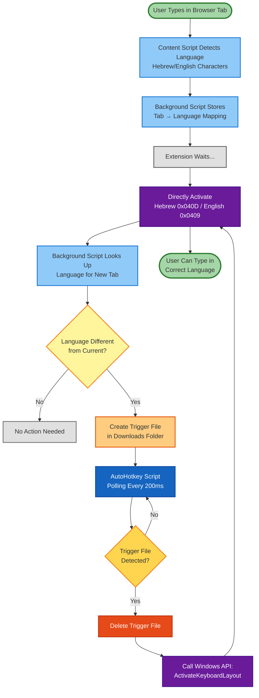

# AutoLang Workflow Diagram

## Component Roles

- **Content Script (content.js)**: Detects typed language from Hebrew/English characters
- **Background Script (background.js)**: Manages tab-to-language mapping & creates trigger files
- **AutoHotkey Script (AutoLangWatcher.ahk)**: Polls Downloads folder & calls Windows API
- **Windows API**: `ActivateKeyboardLayout()` directly switches to specific language layout (0x040D for Hebrew, 0x0409 for English)

## Technical Details

### Trigger File Format
- **Filename**: `autolang_switch_to_hebrew.trigger` or `autolang_switch_to_english.trigger`
- **Content**: Simple text with language name
- **Location**: User's Downloads folder
- **Lifecycle**: Created by Chrome → Detected by AutoHotkey → Immediately deleted

### Keyboard Switching Method
AutoHotkey uses three methods for maximum compatibility:
1. `ActivateKeyboardLayout(HKL, 0)` - Activates layout for current thread
2. `PostMessage(WM_INPUTLANGCHANGEREQUEST)` - Sends message to active window
3. `LoadKeyboardLayout(layoutStr, KLF_ACTIVATE)` - Loads and activates layout

This ensures reliable switching across different Windows versions and configurations.
