# AutoLang Workflow Diagram

```mermaid
flowchart TD
    Start([User Types in Browser Tab]) --> Detect[Content Script Detects Language<br/>Hebrew/English Characters]
    Detect --> Store[Background Script Stores<br/>Tab → Language Mapping]
    Store --> Wait[Extension Waits...]
    
    Wait --> Switch([User Switches to Different Tab])
    Switch --> Lookup[Background Script Looks Up<br/>Language for New Tab]
    Lookup --> Check{Language Different<br/>from Current?}
    
    Check -->|No| NoAction[No Action Needed]
    Check -->|Yes| Download[Create Trigger File<br/>in Downloads Folder]
    
    Download --> Poll[AutoHotkey Script<br/>Polling Every 200ms]
    Poll --> Found{Trigger File<br/>Detected?}
    
    Found -->|Yes| Delete[Delete Trigger File]
    Delete --> Send[Send Alt+Shift<br/>to Windows]
    Send --> OS[Windows Switches<br/>Keyboard Layout]
    OS --> Done([User Can Type in<br/>Correct Language])
    
    Found -->|No| Poll
    
    style Start fill:#c8e6c9,stroke:#2e7d32,stroke-width:3px,color:#000
    style Done fill:#c8e6c9,stroke:#2e7d32,stroke-width:3px,color:#000
    style Detect fill:#bbdefb,stroke:#1976d2,stroke-width:2px,color:#000
    style Store fill:#bbdefb,stroke:#1976d2,stroke-width:2px,color:#000
    style Lookup fill:#bbdefb,stroke:#1976d2,stroke-width:2px,color:#000
    style Check fill:#fff9c4,stroke:#f9a825,stroke-width:2px,color:#000
    style NoAction fill:#e0e0e0,stroke:#616161,stroke-width:2px,color:#000
    style Download fill:#ffe0b2,stroke:#e65100,stroke-width:2px,color:#000
    style Poll fill:#1976d2,stroke:#0d47a1,stroke-width:2px,color:#fff
    style Found fill:#f9a825,stroke:#f57f17,stroke-width:2px,color:#000
    style Delete fill:#ff7043,stroke:#d84315,stroke-width:2px,color:#fff
    style Send fill:#7b1fa2,stroke:#4a148c,stroke-width:2px,color:#fff
    style OS fill:#7b1fa2,stroke:#4a148c,stroke-width:2px,color:#fff
```

## Component Roles

- **Content Script (content.js)**: Detects typed language
- **Background Script (background.js)**: Manages tab languages & triggers switches
- **AutoHotkey Script**: Monitors Downloads folder & sends keyboard shortcuts
- **Windows OS**: Executes keyboard layout switch
